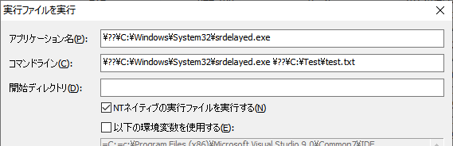

# srdelayedfile

srdelayedfileは、Windowsの付属するSrdelayed.exeが使用するUNICODE テキストファイル（ここでは遅延操作ファイルと呼びます）を作成するツールです。
現在開発中のプレビュー版です。

Srdelayed.exeについて詳細は以下のサイトを参照してください。   
https://learn.microsoft.com/en-us/windows/win32/backup/srdelayed-exe

注：リンク先のドキュメントはプレフィックスの記述などに一部不正確な部分があります。


### 使い方
1. 必要なコマンドを記述したXMLファイルを用意する。

1. srdelayedfileで遅延操作ファイルを作成する。

1. 作成した遅延操作ファイルをレジストリに登録する。

1. コンピュータを再起動する。

#### 例

1. 必要なコマンドを記述したXMLファイルを用意する。
   ~~~xml
    <?xml version="1.0" encoding="utf-8"?>
    <Srdelayed>
        <Commands>
            <MoveFile>
                <SourcePath>C:\Test\subdir\abc.exe</SourcePath>
                <DestinationPath>C:\Test\xyz.exe</DestinationPath>
            </MoveFile>
            <SetShortName>
                <ShortName>XYZ~1.EXE</ShortName>
                <Path>C:\Test\xyz.exe</Path>
            </SetShortName>
            <DeleteFile>
                <Path>C:\Test\subdir</Path>
            </DeleteFile>
        </Commands>
    </Srdelayed>
    ~~~   
   この例では、C:\Test\subdir にある abc.exe を、C:\Testに移動します。次に移動した xyz.exe に XYZ~1.EXEという短い名前を付けて、最後にC:\Test\subdirを削除しています。ディレクトリは空でないと削除できない為、C:\Test\subdirはabc.exeが移動した後は空になる前提です。

1. srdelayedfileで遅延操作ファイルを作成する。

   ````
   srdelayedfile -i <XMLファイル>  -o <遅延操作ファイル>
   ````
   例えばXMLファイルがC:\temp\source.xml にあり、遅延操作ファイルを c:\run\delayedoperations.txtに作成したい場合、以下の様に指定します（カレントディレクトリからの相対パスも使えます）。
   ````
   srdelayedfile -i C:\temp\source.xml  -o c:\run\delayedoperations.txt
   ````

1. 作成した遅延操作ファイルをレジストリに登録する。   
   __※この手順は管理者モードで実行する必要があります。__  レジストリエディタを使ってエントリを作成して登録することもできます。

   ````
   srdelayedfile --setup <遅延操作ファイル>
   ````
   遅延操作ファイルが c:\run\delayedoperations.txtにある場合場合、以下の様に指定します（カレントディレクトリからの相対パスも使えます）。
   ````
   srdelayedfile --setup c:\run\delayedoperations.txt
   ````
   実行するとレジストリの以下の場所にエントリを作成します。エントリが既に存在する場合は最後に追加されます。

   ````
   HKEY_LOCAL_MACHINE\System\CurrentControlSet\Control\Session Manager
   SetupExecute (REG_MULTI_SZ)
   ````

   --setupオプションを付けて実行するとSetupExecuteに以下の様なコマンドラインが追加されます。

   ````
   C:\Windows\System32\Srdelayed.exe \??\c:\run\delayedoperations.txt
   ````
   レジストリエディタを使って手動でエントリを追加することもできます。

1. コンピュータを再起動する。   


## XMLエレメント

#### Srdelayed
Srdelayed.exeの遅延操作ファイルを作成する為のノードセクション。

#### Commands
このノード下に操作コマンドを記述します。

#### MoveFile
ファイルを移動します。SourcePathで指定したパスからDestinationPathで指定したパスへ移動します。移動先は同じボリューム上である必要があります。   
例）
~~~xml
    <MoveFile>
        <SourcePath>C:\Test\subdir\abc.exe</SourcePath>
        <DestinationPath>C:\Test\xyz.exe</DestinationPath>
    </MoveFile>
~~~

#### DeleteFile
ファイルを削除します。Pathで指定したファイルを削除します。ディレクトリを削除する場合は空である必要があります。   
例）
~~~xml
    <DeleteFile>
        <Path>C:\Test\subdir\xyz.exe</Path>
    </DeleteFile>
    <DeleteFile>
        <Path>C:\Test\subdir</Path>
    </DeleteFile>
~~~
#### SetShortName
短い名前を設定します。ShortNamdeで指定した名前をPathで指定したファイルに適用します。
例）
~~~xml
    <SetShortName>
        <ShortName>XYZ~1.EXE</ShortName>
        <Path>C:\Test\xyz.exe</Path>
    </SetShortName>
~~~

## オプション

### 遅延操作ファイルの作成

   ````
   srdelayedfile -i <XML file> -o <delayedoperationsfile>　[-f]
   ````
   `-f`  出力先に同名のファイルが存在した場合、強制的に上書きする。


### 遅延操作ファイルの内容をダンプ

   ````
   srdelayedfile -d <delayedoperationsfile>
   ````


### 遅延操作ファイルをレジストリに登録

   ````
   srdelayedfile --setup <delayedoperationsfile>
   ````

### 最後に検出したエラーを表示

   ````
   srdelayedfile --lasterror
   ````
   Windowsの起動時にSrdelayed.exeが実行された時、エラーが検出された場合、その内容をレジストリに書き込みます。


## Srdelayed.exeを実行する
Srdelayed.exeはNTネイティブ実行ファイルであるため、通常は前述の様にレジストリに登録してWindowsシステムが実行しますが、
[FSWorkbench](https://github.com/yamashita-software-works/FSWorkbench-Preview-Releases)
を使用して実行することもできます。ただし、その際実行される遅延操作ファイル内容は、
当然ながら使用されているファイルの移動や削除はできません。また、FSWorkbenchは管理者モードで実行する必要があります。   
   
FSWorkbenchでNTネイティブ実行ファイルを実行するには、現状ではパラメータの指定方法がWin32と異なるため注意が必要です。
   

1. FSWorkbenchを起動し、メニューの\[ツール\]>\[実行ファイルを実行\]を選択します。

1. ダイアログボックスに以下の画像を参考にパラメータを入力します。

   

    - アプリケーション名に、プレフィックス"\\??\\"を付けて Srdelayed.exeのパスを指定します。
    - コマンドラインに上記のSrdelayed.exeのパスを指定し、続けてスペースを空けて操作遅延ファイルのパスを指定します。どちらも必ず"\\??\\"プレフィックスを付けます。この二つのパラメータはmain関数の argv[0]とargv[1]に相当します。
    - \[NTネイティブの実行ファイルを実行する\]にチェックを入れます。    
    
    ※ "\\??\\"プレフィックスはNTオブジェクトネームスペース内のDOSネームスペースルートを示します。
1. \[実行\]をクリックします。    
   エラーメッセージボックスが表示されなければ実行された筈です。UIは特に表示されないので、操作遅延ファイルの操作結果を確認するか、タスクマネージャなどで実行を確認します。

[FSWorkbench（プレビュー版）はこちらから](https://github.com/yamashita-software-works/FSWorkbench-Preview-Releases/releases)


## Build方法

### 開発環境
ソースからビルドするには　Windows Driver Kit Version 7.1.0 (WDK) と Windows SDK for Windows 7 and .NET Framework 4 (Veriosn 7.1)が必要です。

https://www.microsoft.com/en-us/download/details.aspx?id=11800

https://www.microsoft.com/en-us/download/details.aspx?id=8442

>ISOファイルを使ってSDKをインストールする場合、プラットフォームごとに異なるので注意してください。   
>64bit環境にインストールする時は GRMSDKX_EN_DVD.iso を、
>32bit環境にインストールする時は GRMSDK_EN_DVD.iso をダウンロードしてください。
>適合しないファイルを使用するとエラーとなりインストールできません。


現在のビルド環境は、上記WDKとSDKが以下の場所にインストールされている前提になっています。WDKはデフォルトで下記の場所になっていますが、SDKのデフォルトは異なっているので注意してください。

WDK   
`C:\WinDDK\7600.16385.1`

SDK   
`C:\WinSDK\7.1`

もし別の場所にインストールされている場合は、その場所へのリンクを持つ上記パスと同じ名前のジャンクションポイントをC:ドライブのルートに作成すると便利です。

例)
`C:\WinSDK\7.1 -> C:\Program Files\Microsoft SDKs\v7.1`

>**Warning**   
>現状、ビルドに使用するsourcesファイル内に記述されたWDK/SDKルートパスがハードコードされているためです。
>独自のインストール先を設定したい場合は、sourcesファイルを編集して当該パスを調整する必要があります。
>編集する場合、sourcesファイルに記述するパスにはスペースを含めないでください。

> **Note**   
>SDKのセットアップは、マウントされた(またはCD/DVD)ドライブのルートにあるsetup.exeではなく、Setupフォルダ下のSDKSetup.exe を実行してください。   
> `\Setup\SDKSetup.exe`
>
>
>もしインストール時にエラーが発生した場合は、以下のVS2010再頒布モジュールをアンインストールしてから再度試してみてください。
>
>`Microsoft Visial C++ 2010 x86 Redistributable - 10.0.xxxxx`   
>`Microsoft Visial C++ 2010 x64 Redistributable - 10.0.xxxxx`

> **Note**   
>SDKから最低限必要なものは、ヘッダファイルとライブラリファイルのみです。コンパイラやツールは不要です。


<br>

### ビルド方法
スタートメニューの以下の項目を開きます。

`Windows Driver Kits > WDK 7600.16385.1 > Build Environments>Windows 7`

から

64ビット版をビルドする場合は、`x64 Free Build Environment`

32ビット版をビルドする場合は、 `x86 Free Build Environment`

のどちらかを開きます。

> **Warning**   
Windows 10ではスタートメニュー(Windows Driver Kits)から適切な開発環境を選べない場合があります（シェルリンク名が同じであるため）。
正しく選択できない場合は、シェルリンクがあるスタートアップメニューのフォルダを開いて直接選択してください。

<br>
コマンドプロンプトが開くので、ソースの展開先ディレクトリへ移動して、以下のbuildコマンドを実行します。
<br>
<br>

    build -c

最初のビルドでは以下のオプションをお勧めします。

    build -c -M 1


## License

Copyright (C) YAMASHITA Katsuhiro. All rights reserved.

Licensed under the [MIT](LICENSE) License.
